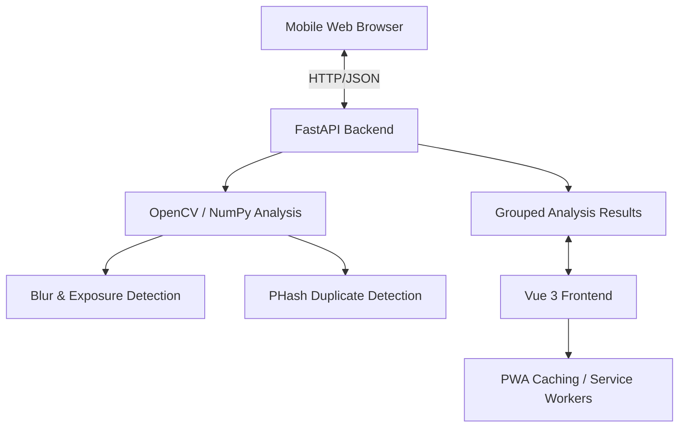

# Pickr: A Phone-First Photo Curation Tool

> **Tagline:** Quickly pick the best photos and discard the rest.

Pickr is a minimalist application designed to help you quickly curate your photo gallery. It analyzes your images for common issues like blur, poor exposure, and near-duplicates, helping you keep only the best shots while freeing up storage.

## 🚀 Features

-   **Upload & Analyze:** Multi-photo upload support with instant analysis.
-   **Intelligent Scoring:** Combined score based on:
    -   **Blur Detection:** Focused analysis on faces if detected.
    -   **Exposure Analysis:** Metrics for brightness, clipping, and dynamic range.
    -   **Contrast & Color:** Evaluates visual punch and vibrancy.
-   **Smart Grouping:** Perceptual hashing (PHash) groups similar and near-duplicate photos.
-   **Best Shot Selection:** Automatically flags the highest-scoring image in each similar set.
-   **Mobile-First UX:** 
    -   **Swipe Gestures:** Swipe left to Delete, right to Keep.
    -   **PWA Ready:** Installable on mobile devices for an app-like experience.
    -   **Glassmorphism Design:** Modern, premium aesthetic with dark mode support.

## 🏗️ Architecture



## 🛠️ Tech Stack

### Backend
-   **Python 3.10+**
-   **FastAPI**: Web framework.
-   **OpenCV / NumPy**: Image processing.
-   **Pillow / pillow-heif**: Format support (HEIC/JPEG/PNG).
-   **Pytest**: Testing framework.

### Frontend
-   **Vue 3**: Reactive UI.
-   **Vite**: Build tool.
-   **ESLint**: Linting and code quality.
-   **Lucide-Vue-Next**: Iconography.

## 🏁 Quick Start

### Backend Setup
1.  **Navigate to backend directory:**
    ```sh
    cd backend
    ```
2.  **Install dependencies:**
    ```sh
    pip install -r requirements.txt
    ```
3.  **Run the server:**
    ```sh
    uvicorn main:app --reload
    ```
    Access API docs at `http://localhost:8000/docs`.

### Frontend Setup
1.  **Navigate to frontend directory:**
    ```sh
    cd frontend
    ```
2.  **Install dependencies:**
    ```sh
    npm install
    ```
3.  **Run in development mode:**
    ```sh
    npm run dev
    ```

## 🧪 Testing

Run backend tests using pytest:
```sh
pytest test_scoring.py
```

## 📜 Contributing
Please refer to [CONTRIBUTING.md](CONTRIBUTING.md) for development guidelines and workflow.

## 📄 License
This project is licensed under the MIT License - see the LICENSE file for details.